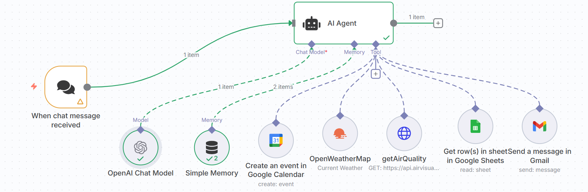
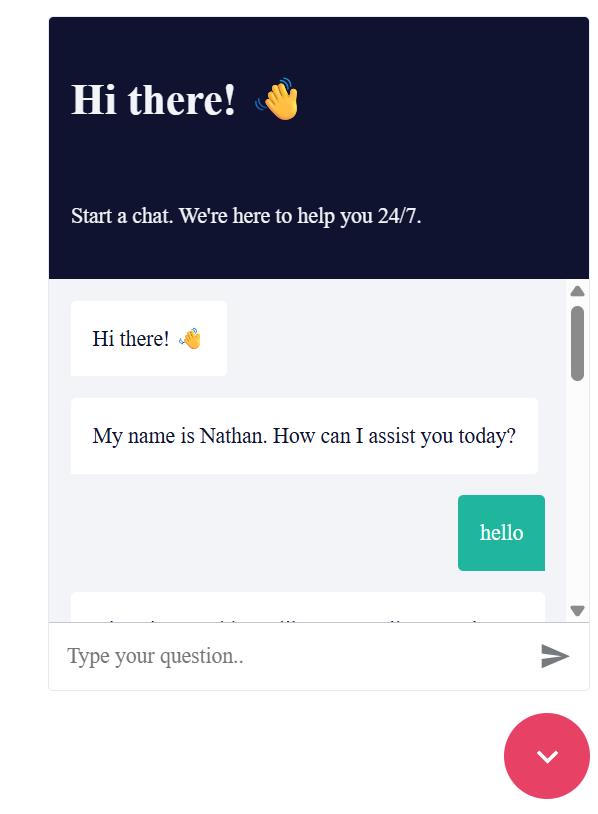
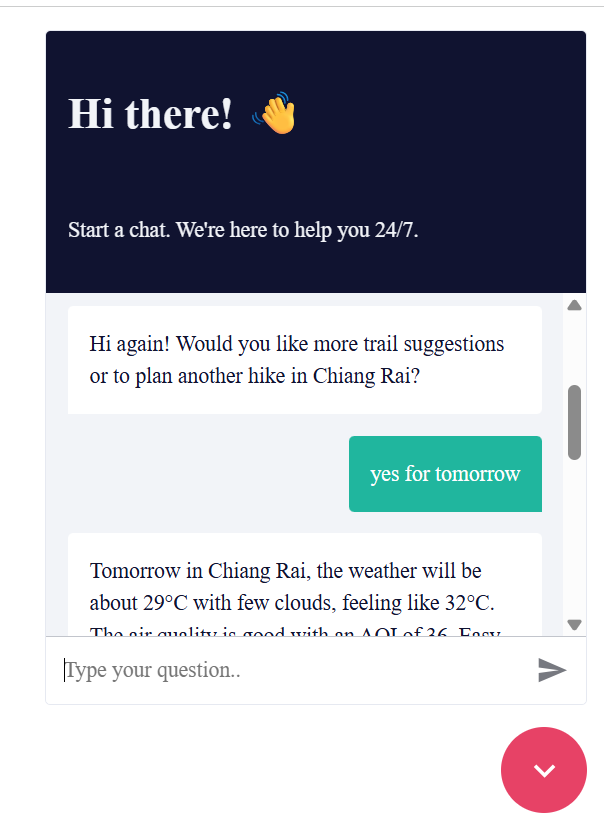
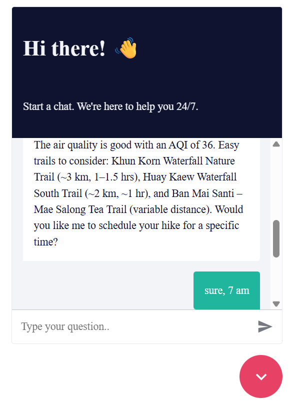
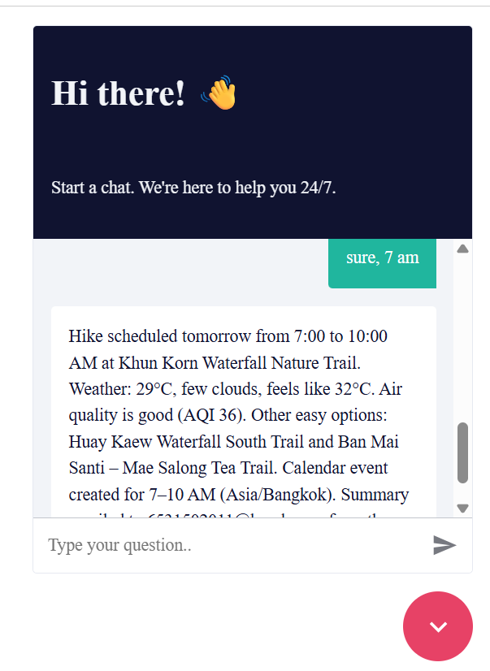

# TrailBot (n8n Chat Trigger) — Chiang Rai Hike Assistant

TrailBot is an n8n chat agent that suggests hiking trails around **Chiang Rai**, checks **weather** + **AQI**, can create a **Google Calendar** event, and emails you a summary.

## What it does
- Weather via **OpenWeatherMap**  
- AQI via **IQAir (AirVisual)**  
- Trail lookup from **Google Sheets**  
- Event creation in **Google Calendar** (STANDARD Create)  
- Summary email via **Gmail** (HTML)

## Prerequisites
- n8n (Cloud or self-hosted)
- API credentials: OpenWeatherMap, IQAir, Google (Sheets, Calendar, Gmail)
- A Google Sheet with trail rows (e.g., `name, distance_km, difficulty, duration, notes`)

## Build the workflow (high level)



1. **Trigger:** `When chat message received`  
   - Make chat publicly available = **ON**  
   - Mode = **Embedded Chat** (copy the **Chat URL** that looks like `/webhook/chat/<id>`)  
   - Allowed origins (CORS): add your site / local dev (e.g., `http://localhost:3000`)  
   - Response mode = **When Last Node Finishes** (simplest)

2. **AI Agent**  
   - *User message* = `{{ $json.chatInput || $json.text || $json.message }}`  
   - *System / Instruction* — use the policy below (copy/paste).  
   - Tool choice = Auto; Max tool executions = 6–8.

3. **Tools (use these exact node names)**
   - **OpenWeatherMap** — Operation: *Current Weather*; Units: Metric; City **✨** on (default “Chiang Rai, Thailand”).  
   - **getAirQuality** — HTTP to `https://api.airvisual.com/v2/city`; *Send Query Parameters* ON, in this order:  
     `city` **✨**, `state` **✨**, `country` **✨**, `key` *(no ✨)*.  
     Leave “Field containing data” blank (or `response.0.data.current.pollution.aqius`).  
   - **Get row(s) in sheet(s) in Google Sheets** — set your Sheet ID + Range.  
   - **Create an event in Google Calendar** — STANDARD “Create”; **Summary/Start/End/Location/Description** **✨** on; TZ `Asia/Bangkok`; Start/End must be RFC3339.  
   - **Send a message in Gmail** — **To/Subject/Message** **✨** on; **Send body as HTML** = ON.

4. **Memory (optional)**  
   - Add **Simple Memory** and connect the memory ports to both Chat Trigger and AI Agent.

5. **Activate** the workflow (header toggle = green). Use the **Production** Chat URL.






## Embed on any site (local or prod)

```html
<link href="https://cdn.jsdelivr.net/npm/@n8n/chat/dist/style.css" rel="stylesheet" />
<script type="module">
  import { createChat } from 'https://cdn.jsdelivr.net/npm/@n8n/chat/dist/chat.bundle.es.js';
  createChat({
    webhookUrl: 'https://YOUR_N8N_DOMAIN/webhook/chat/YOUR_CHAT_ID',
    loadPreviousSession: true,
    enableStreaming: false
  });
</script>
